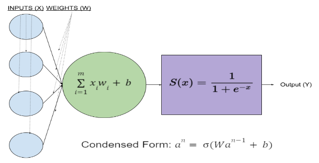

Neural Networks
===============

Overview
--------
Neural networks are advanced machine learning algorithms that can detect complex patterns in large amounts of 
data and make predictions based on the information they have been trained on. 
These systems are designed to mimic the structure of the human brain, with interconnected layers of 
“neurons” that transmit information to each other. 
An artificial neural network typically consists of an input layer, 
one or more hidden layers, and an output layer, each with a specific number of neurons connected to 
preceding and following layers. Deep neural networks are a subtype of artificial neural networks 
that can learn from large datasets and make predictions based on them.

Forward Propagation
-------------------

   **Forward Propagation in a Neural Network**
Forward propagation is the process by which input data is fed through a neural network to produce an output. 
A singular neuron takes in inputs, performs various mathematical operations, and produces an output. 
Each input is multiplied by a certain weight (randomly initialized) from the input layer and is all added 
together in a weighted sum along with a bias term (typically initialized at 0). 
This sum is then passed through an activation function, which plays an integral role in neural networks by 
introducing nonlinear transformations which add necessary complexity. 
The industry standard currently is Rectified Linear Unit (or ReLU), which turns all negative values into 0. 
This process for each neuron is repeated for each layer in the network until the output layer in which 
the SoftMax or sigmoid activation function is applied depending on the number of output neurons. 

Backward Propagation
--------------------
.. figure:: images/landscape.png
   :width: 400px
   :class: with-border

   **Loss Landscape of VGG-56 Neural Network**
Backward propagation, on the other hand, is the process by which the neural network learns from its 
mistakes and improves its predictions. After the process of forward propagation, 
various outputs are returned (prediction of the model). 
How far off the model is in its prediction from the true value is known as 
loss which can be calculated through various functions like mean squared error (MSE). 
The goal in training a neural network is to make the loss value as low as possible, or backpropagation. 
This algorithm computes the gradients (derivatives of multivariable functions) as it moves 
backward through the network, simultaneously updating weights and biases by taking the 
product of the reverse of the gradient and a specified learning rate (gradient descent). 
This forward propagation and backpropagation process is done for a specified number of 
epochs and is a hyperparameter that is often manipulated when training.